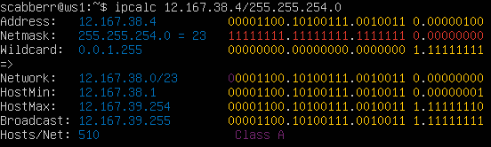
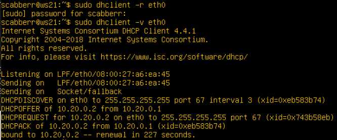

# Linux Network by scabberr

[Part 1. ipcalc tool](#part-1-ipcalc-tool) \
[Part 2. Static routing between two machines](#part-2-static-routing-between-two-machines) \
[Part 3. iperf3 utility](#part-3-iperf3-utility) \
[Part 4. Network firewall](#part-4-network-firewall) \
[Part 5. Static network routing](#part-5-static-network-routing) \
[Part 6. Dynamic IP configuration using DHCP](#part-6-dynamic-IP-configuration-using-dhcp) \
[Part 7. NAT](#part-7-nat) \
[Part 8. Bonus. Introduction to SSH Tunnels](#part-8-bonus-introduction-to-ssh-tunnels)

## Part 1. ipcalc tool

### 1.1. Networks and Masks

-  network address of 192.167.38.54/13 = 192.160.0.0


- conversion of the mask 255.255.255.0 to prefix ( /24 ) and binary (11111111.11111111.11111111.00000000)


- conversion of the mask /15 to normal (255.254.0.0) and binary (11111111.11111110.00000000.00000000)


- conversion of the mask 11111111.11111111.11111111.11110000 to prefix ( /28 ) and normal (255.255.255.240)


- minimum and maximum host in 12.167.38.4/8


- minimum and maximum host in 12.167.38.4/11111111.11111111.00000000.00000000

11111111.11111111.00000000.00000000 = /16


- minimum and maximum host in 12.167.38.4/255.255.254.0



- minimum and maximum host in 12.167.38.4/4


### 1.2. localhost

Localhost is a hostname that refers to the local machine currently making the request. On many computers, localhost is an alias for the IP address 127.0.0.1.

127.0.0.0 — 127.255.255.255 addresses reserved for localhost =>
- 127.0.0.2, 127.1.0.1 - yes
- 194.34.23.100, 128.0.0.1 - no

### 1.3. Network ranges and segments

There are classifications of IP addresses as "private" and "public". The following ranges of addresses are reserved for private (aka LAN) networks:

10.0.0.0 — 10.255.255.255 (10.0.0.0/8),

172.16.0.0 — 172.31.255.255 (172.16.0.0/12),

192.168.0.0 — 192.168.255.255 (192.168.0.0/16).

127.0.0.0 — 127.255.255.255 (Reserved for loopback interfaces (not used for communication between network nodes), so called localhost)

Therefore, 

- 10.0.0.45 - private 
- 134.43.0.2 - public 
- 192.168.4.2 - private
- 172.20.250.4 - private 
- 172.0.2.1 - public
- 192.172.0.1 - public 
- 172.68.0.2 - public 
- 172.16.255.255 - private
- 10.10.10.10 - private
- 192.169.168.1 - public


Which of the listed gateway IP addresses are possible for 10.10.0.0/18 network:


- 10.0.0.1 - no
- **10.10.0.2 - yes**
- **10.10.10.10 - yes**
- 10.10.100.1 - no
- **10.10.1.255 - yes**

## Part 2. Static routing between two machines

### 2.1. Adding a static route manually

View existing network interfaces with the ip a command:

**== ws1 ==**


**== ws2 ==**


Edit the /etc/netplan/00-installer-config.yaml file with the following command:

```
sudo nano /etc/netplan/00-installer-config.yaml
```
**== ws1 ==**


**== ws2 ==**


Restart the network service:

```
sudo netplan apply
```

**== ws1 ==**


**== ws2 ==**


Add a static route from one machine to another and back using **ip r add** command:

**== ws1 ==**


**== ws2 ==**


Ping the connection between the machines:

**== ws1 ==**


**== ws2 ==**


### 2.2. Adding a static route with saving

Restart the machines and add static route from one machine to another using **etc/netplan/00-installer-config.yaml** file:

**== ws1 ==**


**== ws2 ==**


Ping the connection between the machines:

**== ws1 ==**


**== ws2 ==**


## Part 3. iperf3 utility

### 3.1. Connection speed

- 8 Mbps (мегабит/с)  =  1 MB/s (мегабайт/с)
- 100 MB/s (мегабайт/с) = 100 * 1000 * 8 = 800 000 Kbps (килобит/с)
- 1 Gbps (гигабит/с) = 1000 Mbps (мегабит/с)

There is difference in international and Russian standards. The above conversion is done according to the international standard. As for Russian standard, 100 MB/s (мегабайт/с) = 100 * 1024 * 8 = 819 200 Kbps (килобит/с).


### 3.2. iperf3 utility

Measure connection speed between ws1 and ws2.

First, connect to the remote machine which you will use as the server (ws1), and fire up iperf3 in server mode using -s flag, it will listen to port 5201 by default.

**== ws1 ==**


Then on local machine which we will treat as the client (ws2), run iperf3 in client mode using -c flag and specify the host on which the server is running.

**== ws2 ==**


Now ws1 - client, ws2 - server.

**== ws2 ==**


**== ws1 ==**


## Part 4. Network firewall

### 4.1. iptables utility


**-A, --append** {INPUT|OUTPUT|FORWARD|PREROUTING|POSTROUTING} - add rule to chain

**-t, --table** {raw|mangle|nat|filter} - default is filter

**-p --protocol** {tcp|icmp|udp|all}

**--dport, --destination-port**

**--icmp-type** - type of icmp protocol (in this case - echo-reply)

ICMP echo and echo-reply are commonly used in the ping application. 
This sends an ICMP echo to a host, which returns an ICMP echo-reply.

**-j --jump** - target {ACCEPT|REJECT|DROP} : The ACCEPT means to let the packet through. 
Use the REJECT when you want the other end (client or host or bot) to know the port is unreachable and 
use the DROP for connections to hosts you do not want people/bots/client to see.

**== ws1 ==**

A deny rule (reject echo reply) is written at the beginning and an allow rule is written at the end.


**== ws2 ==**

An allow rule (allow echo reply) is written at the beginning and a deny rule is written at the end.


Run the files on both machines with following commands:

``` 
chmod +x /etc/firewall.sh
```

and 

```
/etc/firewall.sh 
```

**== ws1 ==**


**== ws2 ==**


The difference between strategies is based on the order of rules. The first rule is applied and the following rules related to the same target are ignored. Using these rules in different order we can demostrate this mechanism.

### 4.1. nmap utility

Use **ping** command to find a machine which is not pinged.

**== ws1 ==**


**== ws2 ==**


Use **nmap** utility to show that the machine host is up.

**== ws1 ==**


**== ws2 ==**


## Part 5. Static network routing


### 5.1. Configuration of machine addresses

Set up the machine configurations in **etc/netplan/00-installer-config.yaml** according to the network in the picture.

Before setting the configurations we can get information about current network interfaces and macaddress of each machine using:

```
ip a
```
Then we should change **etc/netplan/00-installer-config.yaml** file and use

```
sudo netplan apply
```

If there are no errors, check that the machine address is correct with:

```
ip -4 a
```

**== ws11 ==**


**== ws21 ==**


**== ws22 ==**


**== r1 ==**


**== r2 ==**


Ping ws22 from ws21:


Ping r1 from ws11:


### 5.2. Enabling IP forwarding.

To enable IP forwarding, run the following command on the routers:

```
sysctl -w net.ipv4.ip_forward=1.
```
With this approach, the forwarding will not work after the system is rebooted.

**== r1 ==**


**== r2 ==**


Open **/etc/sysctl.conf** file and add the following line:

```
net.ipv4.ip_forward = 1 
```

With this approach, IP forwarding is enabled permanently.

**== r1 ==**


**== r2 ==**


### 5.3. Default route configuration

Configure the default route (gateway) for the workstations. To do this, add default before the router's IP in the configuration file. Call ip r and show that a route is added to the routing table.

**== ws11 ==**


**== ws21 ==**


**== ws22 ==**


Ping r2 router from ws11 and show on r2 that the ping is reaching. To do this use:

```
 tcpdump -tn -i eth0 
```

(it is impossible to check eth1, ws11 and r2 do not have connection via eth1)

**== ws11 ==**


**== r2 ==**


### 5.4. Adding static routes

Add static routes to r1 and r2 in configuration file.

**== r1 ==**


**== r2 ==**


Run following commands on ws11:

```
ip r list 10.10.0.0/[netmask] 
```

and 

```
ip r list 0.0.0.0/0 
```


A different route other than 0.0.0.0/0 had been selected for 10.10.0.0/[netmask], because 10.10.0.0/18 is inside network, it is available without gateway

### 5.5. Making a router list

Run the following command on r1:

```
tcpdump -tnv -i eth0 dump
```

Use **traceroute** utility to list routers in the path from ws11 to ws21


**User Datagram Protocol (UDP)** packets are sent for analyzing the route which would be taken.
The headers of this protocol comprise of **TTL (Time to Live)** field, which limits the lifespan of data 
in the network. In contrast to the name, this TTL field signifies counter and not time. As soon as a packet is received at the router, the value in the TTL is decreased. 
As the value keeps on decreasing when reaches zero, the packet will be discarded and then the next hop on the 
journey will no longer be possible. As an iterative process, the traceroute will start sending UDP starting 
with TTL value as 1, till either the packet has reached the destination or the maximum value of hops allowed is reached.

### 5.6. Using ICMP protocol in routing

Run on r1 network traffic capture going through eth0 with the:

```
tcpdump -n -i eth0 icmp
```


Ping a non-existent IP (e.g. 10.30.0.111) from ws11 with the:

```
ping -c 1 10.30.0.111
```


## Part 6. Dynamic IP configuration using DHCP

For r2, configure the DHCP service in the **/etc/dhcp/dhcpd.conf file**
Specify the default router address, DNS-server and internal network address.


Write nameserver 8.8.8.8. in a **resolv.conf** file


Restart the DHCP service with:

```
systemctl restart isc-dhcp-server
```


Reboot the ws21 machine with:

```
reboot
```

Show that it has got an address:

```
ip a
```


Ping ws22 from ws21:


Specify MAC address at ws11 by adding to **etc/netplan/00-installer-config.yaml**:


Сonfigure r1 the same way as r2, but make the assignment of addresses strictly linked to the MAC-address (ws11).


Changing **/etc/resolv.conf**


Restarting service:


Check ip a on ws11:


Ping r1 from ws11:


Request ip address update from ws21:

- before request


- request



- after request


## Part 7. NAT

In **/etc/apache2/ports.conf** file change the line Listen 80 to Listen 0.0.0.0:80 on ws22 and r1, i.e. make the Apache2 server public

**== r1 ==**


**== ws22 ==**


Start the Apache web server with service apache2 start command on ws22 and r1

**== r1 ==**


**== ws22 ==**


Add the following rules to the firewall, created similarly to the firewall from Part 4, on r2:
1) delete rules in the filter table
```
iptables -F
```
2) delete rules in the "NAT" table
```
iptables -F -t nat
```
3) drop all routed packets
```
iptables --policy FORWARD DROP
```


Check the connection between ws22 and r1 with the ping command:


Add another rule to the file:

4) allow routing of all ICMP protocol packets


Check connection between ws22 and r1 with the ping command:


Add two more rules to the file:

5) enable **SNAT**, which is masquerade all local ip from the local network behind r2 (as defined in Part 5 - network 10.20.0.0)

6) enable **DNAT** on port 8080 of r2 machine and add external network access to the Apache web server running on ws22


Check the TCP connection for SNAT by connecting from ws22 to the Apache server on r1 with:

```
telnet [address] [port] command
```


Check the TCP connection for DNAT by connecting from r1 to the Apache server on ws22 with the telnet command (address r2 and port 8080)


## Part 8. Bonus. Introduction to SSH Tunnels

Start the Apapche web server on ws22 on localhost only (i.e. in **/etc/apache2/ports.conf** file change the line Listen 80 to Listen localhost:80)


```
sudo service apache2 start
```

### Local TCP forwarding

Use Local TCP forwarding from ws21 to ws22 to access the web server on ws22 from ws21:


```
ssh -L LOCAL_PORT:DESTINATION:DESTINATION_PORT [USER@]SSH_SERVER
```


### Remote TCP forwarding

Use Remote TCP forwarding from ws11 to ws22 to access the web server on ws22 from ws11:


```
ssh -R REMOTE_PORT:DESTINATION:DESTINATION_PORT [USER@]SSH_SERVER
```


